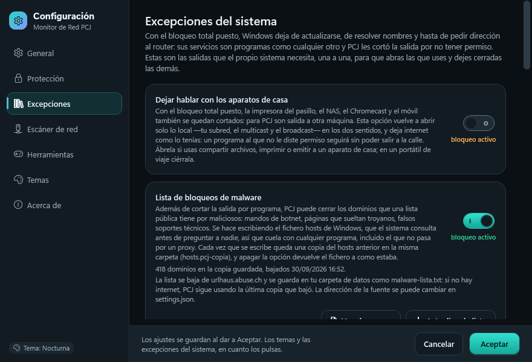
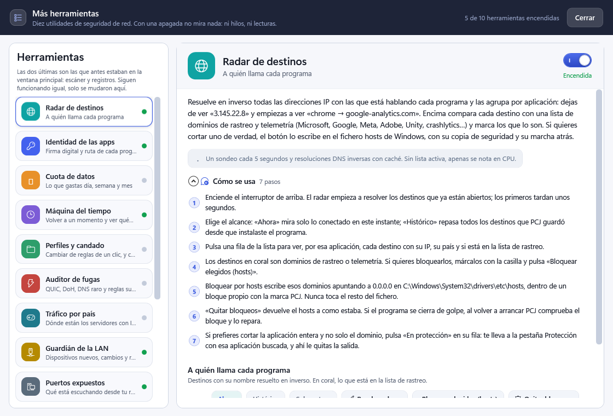
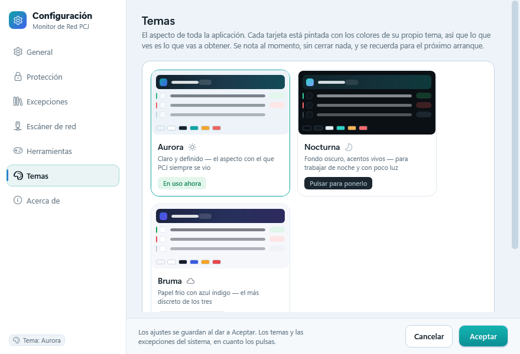
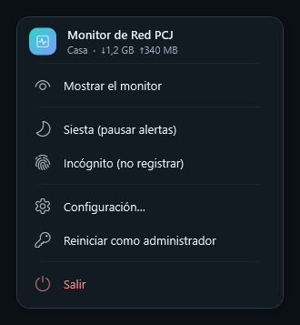
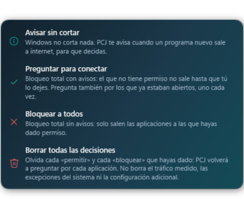

# Monitor de Red PCJ

Monitor de tráfico de red con firewall de aplicación para Windows 10 y 11, escrito desde cero en
C# (WPF, .NET 8) y con la interfaz en español. Es software libre con licencia MIT: sin funciones
de pago, sin cuentas y sin telemetría.

El programa vigila **qué aplicación abre cada conexión**, deja decidir a uno mismo cuáles pueden
salir a internet, y explica con detalle lo que está pasando en la máquina.

Versión actual: **1.6.9**. Este repositorio contiene solo código fuente; no se publican binarios.

---

## Qué hace

**Protección (firewall de aplicación).** Con el bloqueo total puesto, la política de salida de
Windows Firewall queda en `BlockOutbound`: ninguna aplicación puede salir a internet salvo que
tenga una regla propia `MRPCJ: <app> SALIDA PERMISO`. Cuando una app sin decidir intenta conectar
aparece un aviso flotante con su nombre, su ruta completa y los botones Permitir / Bloquear, y
también se puede responder desde la lista. La lista de Protección enseña solo las aplicaciones
vivas o que pidieron salida, con una barra de ventana de minutos (incluido un modo «en vivo») y
cuatro recuentos que funcionan como filtros.

**Monitor de tráfico.** Gráfico de subida y descarga en tiempo real, por aplicación, con su peso
acumulado y los hosts remotos que contactó.

**Registros.** Historial de primeras conexiones, cambios de reglas y dispositivos nuevos, con
filtros y marcado de leído.

**Escáner de red.** Descubre dispositivos en la red local (ping + ARP + DNS inverso) y permite
confiar u olvidar los que ya se conocen.

**Recursos.** CPU, memoria, disco, GPU y temperatura del disco, con gráficas por minuto.

**Más herramientas.** Doce fichas: diez utilidades de seguridad de red —radar de destinos,
identidad de las apps, cuota de datos, máquina del tiempo, perfiles y candado, auditor de fugas,
tráfico por país, guardián de la LAN, puertos expuestos e informe— más el escáner de red y los
registros, que siguen funcionando igual pero se mudaron aquí. Cada una se puede poner como
pantalla principal desde Ajustes.

**Ajustes.** Siete pestañas. Entre ellas, «Excepciones del sistema»: quince apartados para dejar
pasar por separado los servicios de Windows que el bloqueo total también corta (DHCP, DNS,
actualizaciones, escritorio remoto, …), cada uno con su estado escrito —*bloqueo activo* o
*bloqueo inactivo*— y su explicación plegable. Incluye el tráfico de red local y una lista de
bloqueo de malware que se escribe en el fichero `hosts` de Windows.

**Tres temas** (Aurora, Nocturna y Bruma) que se cambian en caliente, sin reiniciar.

**Bandeja.** Menú propio con mostrar, pausa de avisos, modo incógnito, configuración y salida.

Todo el código de este repositorio es autoría de PCJ; no hay librerías de terceros ni paquetes
NuGet. El proyecto `.csproj` solo activa `UseWPF` y `UseWindowsForms`, y el resto son APIs que
aporta Windows o el propio .NET. Lo que el programa **sí** puede consultar fuera de tu equipo son
dos servicios públicos opcionales, y están documentados uno por uno en
[Servicios externos](#servicios-externos).

---

## Pantallas

| | |
|---|---|
| <br>**Ajustes → Excepciones del sistema** (Nocturna). Cada interruptor dice debajo si su bloqueo está activo o inactivo, y «ver la explicación» saca para qué sirve y qué reglas escribe. | <br>**Más herramientas → Radar de destinos** (Bruma). Ficha con su descripción, su guía en siete pasos y el interruptor propio. |
| <br>**Ajustes → Temas** (Aurora). El tema se cambia en caliente, sin reiniciar. | <br>**Menú de la bandeja**. `Popup` propio con bordes suaves: la plantilla de `ContextMenu` de WPF no admite transparencia. |
| <br>**Menú de los modos** de la pestaña Protección (Aurora), desde 1.6.8 con cuatro opciones: las tres primeras cambian el modo y la cuarta borra lo respondido para que vuelva a preguntar. Se fotografía con `--modos-preview` porque un `RenderTargetBitmap` de la ventana nunca captura un `Popup`. | |

No hay captura de la pestaña Protección a propósito: su lista enseña las aplicaciones instaladas y
las rutas de su usuario. Se puede generar con `--protect-preview` (ver más abajo). Las cinco
capturas incluidas se generan con los modos de comprobación del propio programa, así que salen de
una instalación de ejemplo y no contienen datos de ninguna máquina real.

## Requisitos

Windows 10 o 11 de 64 bits. Para bloquear la salida hace falta poder elevarse una vez.

Para compilar: **SDK de .NET 8** y **Inno Setup 6** (este último solo si quieres generar el
instalador; para ejecutar la app basta `dotnet run --project src/MonitorRedPCJ`). El repositorio
no trae fichero `.sln`: se trabaja directamente con `src/MonitorRedPCJ/MonitorRedPCJ.csproj`.

## Instalación

No hay binarios en el repositorio. La vía normal es compilar:

```powershell
git clone https://github.com/PCJJob/Monitor-Red-PCJ.git
cd Monitor-Red-PCJ
powershell -ExecutionPolicy Bypass -File build.ps1
```

Eso deja el instalador en `dist/MonitorRedPCJ-Setup-<versión>.exe`. Al ejecutarlo, Inno Setup pide
permisos una vez, instala en `C:\Program Files\MonitorRedPCJ` y registra la tarea programada
`MonitorRedPCJ`, que es la que relanza el programa elevado cuando hace falta tocar el firewall.

Para probar sin instalar vale con `dotnet build src/MonitorRedPCJ/MonitorRedPCJ.csproj -c Release`
y ejecutar el `.exe` que queda en `bin\Release\net8.0-windows\`.

La publicación es *self-contained*: el instalador lleva su propio runtime de .NET y el PC donde se
instale no necesita tener .NET instalado.

## Estructura

```
src/MonitorRedPCJ/
  App.xaml(.cs)        arranque, argumentos de línea de comandos, tareas programadas
  MainWindow.xaml(.cs) ventana marco: navegación entre vistas
  Models.cs            tipos compartidos (ajustes, app registrada, evento)
  Native/              P/Invoke: iphlpapi, psapi, proceso, iconos, elevación
  Services/            toda la lógica, sin UI
    FirewallService    reglas MRPCJ:, políticas de salida, modo estricto
    TrafficService     sondeo de conexiones y contadores por proceso
    AppExcepciones     catálogo de las quince excepciones del sistema
    MalwareService     descarga y análisis de la lista, escritura del hosts
    Tools/             servicios de las doce herramientas
  Views/               una clase por pantalla; ProtectView y SettingsWindow son las grandes
  Themes/Theme.xaml    estilos y controles, todos enlazados por DynamicResource
  Themes/Temas/        las tres paletas (solo claves de color)
  Controls/            Graphs.cs (gráficas dibujadas a mano) y Fx.cs (animaciones)
installer/setup.iss    instalador Inno Setup 6
installer/register-task.ps1  tarea programada que eleva el .exe al arrancar
tools/gen-icon.ps1     genera assets/app.ico
tools/comentarios-xaml.ps1  revisa los comentarios XAML (un «--» dentro rompe la compilación)
build.ps1              publica la app self-contained y compila el instalador
```

No hay dependencias NuGet: el `.csproj` solo activa `UseWPF` y `UseWindowsForms`.

## Compilar

Hace falta el **SDK de .NET 8** y **Inno Setup 6**. Con los dos instalados:

```powershell
powershell -ExecutionPolicy Bypass -File build.ps1
```

El instalador sale en `dist/MonitorRedPCJ-Setup-<versión>.exe` y se copia a la raíz. La
publicación es *self-contained*, así que el instalador lleva su propio runtime y el PC donde se
instale no necesita .NET.

Para subir de versión hay que tocar los dos números: `<Version>` en
`src/MonitorRedPCJ/MonitorRedPCJ.csproj` y `MyAppVersion` en `installer/setup.iss`
(ese fichero lleva BOM UTF-8; si se reescribe con un guion, conservarlo).

## Comprobar un cambio sin tocar el firewall

El ejecutable admite modos de comprobación que se atienden **antes** de la elevación, del mutex de
instancia única y de crear la carpeta de datos: no piden UAC, no escriben reglas y no interfieren
con el programa abierto. Sirven para revisar una pantalla antes de instalarla.

```powershell
# pinta la pestaña de Protección a PNG (con la copia de bin/Release, sin instalar)
bin\Release\net8.0-windows\MonitorRedPCJ.exe --protect-preview prot.png 12000 0 nocturna

# autochequeo del catálogo de excepciones: 438 comprobaciones y un parte de texto
bin\Release\net8.0-windows\MonitorRedPCJ.exe --excepciones-check parte.txt
```

Los modos son `--main-preview`, `--protect-preview`, `--settings-preview`, `--tools-preview`,
`--ajuste-preview`, `--malware-preview`, `--menu-preview`, `--modos-preview`, `--menu-show`,
`--protect-window-check`, `--tools-check`, `--ajuste-check`, `--excepciones-check`,
`--malware-check`, `--theme-check`, `--cola-check`, `--search-bench` y `--malware-fetch`. Si un modo
de foto falla, deja el motivo en `<archivo>.err` junto al PNG.

## Empezar de cero con las decisiones

El menú de los modos de Protección tiene una cuarta opción, **«Borrar todas las decisiones»**: quita
los permisos y bloqueos que diste aplicación por aplicación, y el programa vuelve a preguntar por
cada una. Respeta la regla de salida del propio monitor (sin ella no puede bajar la lista de
malware), las excepciones del sistema, los bloqueos por puerto, la «Configuración adicional» y el
histórico de tráfico. Es la vía normal para probar el programa en un equipo donde alguien ya decidió
antes que tú.

## Dónde guarda sus datos

Todo en `%AppData%\MonitorRedPCJ`: `settings.json`, `apps.json`, eventos, dispositivos y la caché
`malware-lista.txt`. Borrar la carpeta deja el programa como recién instalado. Nada de eso se
sube a ninguna parte: es la carpeta de datos del propio equipo.

## Privacidad

El programa funciona **en local**. El registro de conexiones, las reglas del firewall, el
histórico de tráfico, los recursos, los registros y los ajustes se leen y se escriben en tu
propia máquina; no hay servidor propio, ni cuenta, ni telemetría, ni envío de estadísticas de
uso, y el programa no necesita identificarse con ningún servicio externo para funcionar.

Eso **no** significa que el programa sea 100 % sin conexión ni que nunca salga tráfico de tu
equipo. Hay tres cosas que sí lo hacen, y las tres son opcionales o consecuencia directa de una
función que tú pides:

- **La lista de bloqueo de malware** descarga un fichero de un servicio público. Está **apagada
  por defecto** y solo se baja cuando pulsas «Actualizar la lista». Detalle completo en
  [Servicios externos](#servicios-externos).
- **Saber el país de cada IP** (`Más herramientas → Tráfico por país`) pregunta a ip-api.com. El
  interruptor «Consultar ip-api.com para saber el país de cada IP» está **apagado por defecto**, a
  la vista y no escondido, porque la consulta sale sin cifrar. Si lo dejas apagado, la ficha
  funciona igual con la base local `geoipv4.csv` (si la pones en la carpeta de datos) o enseña las
  direcciones sin país.
- **Las funciones que usan el resolutor de Windows**: el radar de destinos hace consultas DNS
  inversas para traducir cada IP remota a su nombre, el escáner de red hace ping y ARP a los
  aparatos de tu red local y resuelve nombres, y el navegador normal de tu sistema también
  consulta DNS. Esas peticiones van al servidor DNS configurado en el equipo (el router o el que
  tú uses), como las de cualquier otra aplicación.

Y una nota sobre el modo **incógnito** de la bandeja: apaga el registro histórico y, además,
bloquea las dos consultas anteriores —con el incógnito puesto, PCJ no sale a preguntar nada a
pesar de que los interruptores estén encendidos—.

Lo que **no** hace el programa, para que no queden dudas: no sube la lista de tus aplicaciones, no
envía identificadores del equipo ni del disco, no tiene servicio de actualizaciones en la nube ni
comprueba si hay una versión nueva, y no comparte nada entre usuarios del programa.

## Servicios externos

Son dos, ambos opcionales, ambos con el interruptor apagado por defecto. El programa no tiene
ningún otro punto de salida a internet: en el código solo hay dos `HttpClient`, uno en
`Services/MalwareService.cs` y otro en `Services/Tools/GeoService.cs`.

### Lista de bloqueo de malware — urlhaus.abuse.ch

**No es una lista propia de PCJ.** La mantiene [abus.ch](https://urlhaus.abuse.ch/) y el programa
solo la descarga y la usa. PCJ no revisa ni garantiza el contenido de cada dominio.

| | |
|---|---|
| Qué URL se usa hoy | `https://urlhaus.abuse.ch/downloads/hostfile/` (HTTPS, puerto 443). Está en `Models.cs` como valor inicial de `MalwareListaUrl` y se puede cambiar a otra fuente en formato hosts escribiéndola en `%AppData%\MonitorRedPCJ\settings.json`. |
| Qué archivo baja | El fichero en formato `hosts` de urlhaus: cada línea es una dirección (`127.0.0.1` o `0.0.0.0`) seguida de un dominio que ese servicio tiene por malicioso —mandos de botnet, páginas que sueltan troyanos—. El lector del programa también acepta una lista pelada de dominios, uno por línea. |
| Cuándo se descarga | Solo cuando tú lo pides: Ajustes → «Excepciones del sistema» → *Lista de bloqueos de malware* → **Actualizar la lista** (o el modo `--malware-fetch` desde la línea de comandos). No hay renovación automática ni tarea que la repita. |
| Dónde se guarda | `%AppData%\MonitorRedPCJ\malware-lista.txt`, con la fecha de la descarga. Es una copia local: sin internet el programa sigue usando la última que bajó. |
| Cómo se usa | PCJ limpia el fichero (quita comentarios, rutas, comodines y duplicados), lo recorta a un máximo de 20.000 entradas y escribe su propio bloque en `C:\Windows\System32\drivers\etc\hosts`, con cada dominio apuntando a `0.0.0.0` para que quien intente abrirlo no obtenga respuesta. Escribe **solo** entre sus dos marcas, deja intacto el resto del fichero —incluido el bloque del radar de destinos—, y antes de la primera escritura deja una copia `hosts.pcj-copia`. Necesita permisos de administrador y vacía la caché DNS al terminar. |
| Si la descarga falla | No se borra nada: se conserva la última copia buena, se muestra el motivo en el panel de progreso y el interruptor queda en su estado anterior. El error más típico es el 10013, que significa que el propio bloqueo total de PCJ no deja salir al monitor; el panel lo dice con esas palabras y explica qué excepciones del sistema hay que dejar pasar. |
| Estado por defecto | **Apagado** (`BloqueoMalwareActivo = false`), porque toca un fichero del sistema. |
| Condiciones de uso | Son las de abus.ch para sus listas y feeds públicos, no las de este repositorio. Antes de republicar o redistribuir esa lista, revisa los términos del proveedor en su web. La licencia MIT de este proyecto cubre el código, no esos datos. |

Y una advertencia honesta: una lista de dominios conocida por maliciosos es **un filtro más**, no
una protección completa. No cubre dominios nuevos, ni HTTPS con certificados válidos, ni malware
que no pasa por un dominio de esa lista.

### País de cada IP — ip-api.com

Función **opcional y secundaria**: sirve para colorear y agrupar una lista por países. No es parte
del firewall ni de la protección; con el interruptor apagado el programa protege exactamente igual.

| | |
|---|---|
| Qué URL se usa | `http://ip-api.com/batch?fields=status,countryCode`, petición POST con un array JSON dentro (código en `Services/Tools/GeoService.cs`). **HTTP, no HTTPS, puerto 80**: la consulta viaja sin cifrar. |
| Qué sale del equipo | Las **direcciones IP remotas** que el programa quiere clasificar, de cien en cien por petición, y el identificador de programa `MonitorRedPCJ/1.4` en la cabecera `User-Agent`. No se envía el nombre de la aplicación, ni la ruta del ejecutable, ni tu IP pública, ni el nombre del equipo ni ningún identificador. Conviene asumirlo, además: al preguntar por HTTP, quien controle la red puede leer esas direcciones de destino. |
| Cuándo se pregunta | Solo con el interruptor «Consultar ip-api.com para saber el país de cada IP» encendido (por defecto está **apagado**, `PaisesConsultarOnline = false`) y sin el modo incógnito puesto. Se dispara al abrir la ficha *Tráfico por país* o con el botón «Resolver ahora», que avisa con palabras si no tiene permiso para salir. |
| Dónde se guarda | `%AppData%\MonitorRedPCJ\geo-cache.json`: dirección IP → código de país, para no volver a preguntar. Hay además un `geo-vistos.json` con las direcciones ya procesadas. |
| Si falla | El servidor no responde, contesta `fail` o se pasa del límite de ritmo: la dirección vuelve a la cola con un intento gastado (máximo tres) y la fila se queda como «Sin resolver». Si el servidor directamente no contestó —sin internet, o con el bloqueo total puesto— no se gasta intento y la cola se conserva entera. Nunca se sustituye el país por un valor inventado. |
| Alternativa sin salir de casa | Deja el interruptor apagado y pon una base `geoipv4.csv` (IP inicial, IP final, código de país) en `%AppData%\MonitorRedPCJ\`. Con esa base la ficha resuelve el país sin hacer ninguna consulta. |
| Condiciones de uso | Las de ip-api.com, no las de este repositorio. Su uso gratuito tiene límite de peticiones y requiere atribución; el programa no es un cliente oficial y no redistribuye su base de datos. |

El resto de la información que aparece en la interfaz —nombres de proceso, rutas, puertos,
contadores de tráfico, temperatura del disco— se saca de APIs de Windows en local.

## Seguridad

Monitor de Red PCJ es una **herramienta de monitoreo y de control de salida** construida encima de
Windows Firewall. Lo que aporta es visibilidad y la capacidad de cortar el tráfico de salida
aplicación por aplicación, con reglas que puedes revisar y borrar tú mismo.

> Ningún software puede garantizar protección absoluta contra todas las amenazas. Monitor de Red
> PCJ debe utilizarse como una herramienta adicional de seguridad y monitoreo, manteniendo Windows
> y sus componentes de seguridad actualizados.

En concreto, para que nadie se lleve una sorpresa:

- **No sustituye a Windows Defender ni a un antivirus.** No analiza ficheros, no examina el
  contenido del tráfico y no detecta malware por comportamiento. Un programa malicioso al que tú
  le des permiso de salida tiene ese permiso, y un programa legítimo infectado puede usarlo.
- **No reemplaza al firewall de Windows: lo usa.** Las reglas `MRPCJ:` son reglas normales de
  Windows Firewall y se pueden editar desde el panel del sistema. Si otro programa cambia las
  políticas de salida, PCJ lo detecta y lo avisa, pero no puede impedirlo.
- **El bloqueo de salida no cifra nada ni protege en redes públicas.** Corta conexiones; no es una
  VPN ni un proxy seguro.
- **La lista de dominios es un filtro adicional**, con las limitaciones ya descritas.
- **Puede pedir permisos de administrador**, y solo para tocar cosas del sistema: escribir o borrar
  reglas `MRPCJ:` del firewall, cambiar la política de salida (bloqueo total y modo estricto),
  poner o quitar el candado de salida, bloquear puertos de entrada, limpiar reglas obsoletas y
  escribir el fichero `hosts`. El manifiesto de la aplicación es `asInvoker`, así que el programa
  normal corre sin elevar; cada una de esas operaciones lanza una copia elevada puntual del propio
  ejecutable, y la tarea programada `MonitorRedPCJ` existe únicamente para relanzar elevado cuando
  hace falta.
- **Antes de activar el bloqueo total, revisa las excepciones del sistema.** Con la salida cortada
  también se cortan DHCP, DNS, las actualizaciones de Windows o el escritorio remoto, y para eso
  están los quince apartados de Ajustes.
- **Puedes volver atrás en cualquier momento**: `netsh advfirewall firewall delete rule name=all
  group="Monitor de Red PCJ"`, el desinstalador, o «Borrar todas las decisiones» dentro del
  programa.

Si encuentras un fallo de seguridad, repórtalo como se indica en
[Reportar problemas](#reportar-problemas).

## Licencia

MIT — ver [LICENSE](LICENSE). Puedes usar, modificar y redistribuir el código, incluido con fines
comerciales, manteniendo el aviso de autoría.

Copyright (c) 2026 PCJ.

La licencia cubre **solo el código** de este repositorio: el C#, los XAML, los guiones y los
documentos. **No** cubre los datos de los servicios externos que el programa puede consultar de
forma opcional —la lista de dominios que publica urlhaus.abuse.ch y las respuestas de
geolocalización de ip-api.com—. Esas bases de datos **son propiedad de sus respectivos
proveedores, no son obra de PCJ y PCJ no reclama ningún derecho sobre ellas**, y la licencia MIT no
otorga derechos sobre datos de terceros: quien active esas funciones, o quiera republicar o
redistribuir sus resultados, **debe respetar las condiciones de uso de cada servicio**, que fija
cada proveedor y son distintas de esta licencia. Están detalladas arriba, en
[Servicios externos](#servicios-externos).

Tampoco cubre las herramientas con las que se compila: .NET 8 / WPF (SDK de Microsoft, uso gratuito
para crear aplicaciones) e Inno Setup 6, con licencia propia y usada aquí solo para generar el
instalador. Los iconos de la interfaz son los glifos que aporta Windows (Segoe UI Variable /
Fluent Icons), y el icono de la aplicación se genera con `tools/gen-icon.ps1`.

**Origen de algunas ideas.** El corte de dominios por lista pública (`Ajustes → Lista de bloqueos
de malware`) está inspirado en TinyWall, proyecto de código abierto con licencia MIT; de TinyWall
no se copió código, recursos ni archivos —el comentario de cabecera de
`Services/MalwareService.cs` lo deja dicho—. El resto es implementación propia sobre APIs de
Windows.

## Reportar problemas

Usa la pestaña [**Issues**](https://github.com/PCJJob/Monitor-Red-PCJ/issues) de este repositorio
de GitHub. No hay dirección de correo ni otro canal oficial.

Ayuda mucho si incluyes: la versión (menú de Ajustes → Acerca de, o `<Version>` en el
`.csproj`), Windows 10 u 11, qué esperabas y qué ha pasado, y si el problema es del firewall, la
salida de `netsh advfirewall firewall show rule name=all` filtrando por `MRPCJ:`. Si es un fallo
de dibujo, una captura de la ventana. **Antes de adjuntar un registro o una captura, repásala**:
las fichas de Protección y del escáner muestran rutas y nombres de tu equipo, y el histórico de
tráfico puede contener direcciones que prefieras no publicar.

## Summary (English)

Monitor de Red PCJ is a free, open-source (MIT) network monitor and application firewall for
Windows 10/11, written from scratch in C# (WPF, .NET 8). The interface is in Spanish. It shows
which application opens each connection, blocks outbound traffic per application through Windows
Firewall rules prefixed `MRPCJ:`, and asks you to allow or deny each app the first time it tries
to reach the internet. It also includes a live traffic graph, connection and rule logs, a LAN
scanner, hardware/resource graphs and twelve network-security tools.

There are no NuGet dependencies, no paid features, no account and no telemetry. Two **optional**
outbound queries exist, both switched off by default and both documented in detail above:
downloading the public malware-domain list from `https://urlhaus.abuse.ch/downloads/hostfile/`
(HTTPS) when you press "Actualizar la lista", and the "traffic by country" panel asking
`http://ip-api.com/batch` (plain HTTP, unencrypted) for the country code of remote IP addresses
you explicitly allow it to query. Reverse DNS lookups made by the destination radar and the LAN
scanner go through the system resolver, as with any other application. No application names, file
paths, machine identifiers or usage statistics ever leave the computer.

No software can guarantee absolute protection against every threat. Use this program as an
additional security and monitoring tool, and keep Windows and its security components up to date.

The MIT licence covers this repository's code only. The URLhaus blocklist and the ip-api responses
are owned by their respective providers, not by PCJ, and PCJ claims no rights over them. The MIT
licence grants no rights over third-party data: anyone who enables those features, or who wants to
republish or redistribute their results, must follow each service's own terms, which are separate
from this licence.
